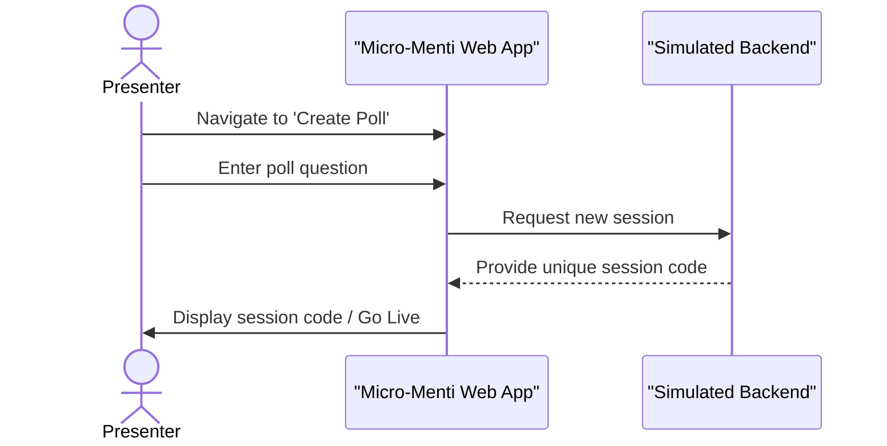

# Micro-Menti Frontend

Micro-Menti Frontend is a dynamic and interactive web application designed to facilitate real-time audience engagement. It transforms live participant responses into visually appealing word clouds, making presentations, lectures, and workshops more interactive and engaging. This project is built to offer a seamless experience for both presenters and participants, with a focus on instant feedback and clear visualization.

## Overview

This project lets presenters easily create live polls and instantly visualize audience feedback as dynamic word clouds. It solves the problem of static, one-way presentations by enabling immediate, visual interaction, making discussions more engaging and giving presenters quick insights into audience sentiment. There's no complicated setup, just straightforward functionality that works right in your browser.

## Installation

Getting Micro-Menti Frontend up and running on your local machine is straightforward. Follow these steps to set it up:

### Clone the Repository

First, grab a copy of the project files from GitHub:

```bash
git clone https://github.com/johnsonabiodun313/Micro-Menti-Frontend.git
```

### Navigate to the Project Directory

Change into the newly cloned project folder:

```bash
cd Micro-Menti-Frontend
```

### Open in Browser

This is a static web application. You don't need a build step or a local server. Simply open `index.html` in your web browser:

```bash
# On most systems, this command will open the file in your default browser
open index.html
```

Alternatively, you can manually navigate to the `index.html` file in your file explorer and double-click it.

## Usage

Micro-Menti Frontend provides distinct user flows for presenters and participants, designed for ease of use and real-time interaction.

### As a Presenter

1. **Create a New Poll**: Navigate to the [Create Poll page](create_screen/create.html). Here, you'll enter your poll question or topic.
    * After entering your question, click the "Go Live Instantly" button to start your session.
    * The page will display a unique 4-digit session code, like this:

```bash
JOIN: 5591
```

* You'll then typically share this code with your audience.

2.**View Live Results**: Once your poll is live, you can monitor audience contributions in real-time. The system simulates dynamic word cloud updates as participants submit their words.
    * The live word cloud screen will dynamically adjust word sizes based on their frequency of submission, providing an immediate visual representation of popular responses.

### As a Participant

1.**Join a Session**: Access the [Join Session page](pin.html).
    * Enter the 4-digit session code provided by the presenter.
    * Alternatively, the system simulates scanning a QR code for instant entry. Click "Scan Presenter's QR Code" to experience this feature.
    * After joining, you'll be directed to the [Contribution page](contribute_screen/contibute.html).

2.**Contribute to the Word Cloud**: On the contribution page, you can enter your response (typically a single word) to the presenter's question.
    * Type your word into the input field and click "Submit".
    * Your contribution will instantly be added to the live word cloud visible on the presenter's screen.

### Ending a Session

After a session, participants can view a summary of their contributions on the [Session Ended page](end_screen/end.html), where they can also see aggregated stats and a simulated option to export their cloud.

## Features

Micro-Menti Frontend comes packed with features designed to make audience engagement seamless and visually compelling.

* **Real-time Word Clouds**: Instantly visualize audience responses as words grow and shift based on frequency.
* **Frictionless Participation**: Participants can join sessions using a simple 4-digit code or simulated QR scan, with no sign-ups or downloads required.
* **Intuitive Presenter Controls**: Easily create polls, share session codes, and monitor live feedback from a clean interface.
* **Dynamic Visuals**: Words in the cloud automatically scale in size, creating a compelling visual representation of collective sentiment.
* **Interactive Demo**: The landing page includes a live sandbox where you can try submitting words and see the cloud react.
* **Optimized for Performance**: Built with lightweight assets and animations for a smooth experience across devices.

### System Architecture

At its core, Micro-Menti Frontend is a client-side web application designed to be highly interactive. It's envisioned as the user-facing part of a larger system, with a conceptual "Simulated Real-time Service" handling the dynamic data updates typical of such platforms.

```mermaid
flowchart LR
    USER["Audience / Presenter"]
    WebClient["Micro-Menti Web App (HTML/CSS/JS)"]
    Backend["Simulated Real-time Service"]

    User -- Access UI --> WebClient
    WebClient <--> Backend: Real-time Data (WebSockets)

    style User fill:#1e1b4b,stroke:#6366f1,stroke-width:2px,color:#fff
    style WebClient fill:#1e1b4b,stroke:#6366f1,stroke-width:2px,color:#fff
    style Backend fill:#2e1065,stroke:#8b5cf6,stroke-width:2px,color:#fff
```

### Poll Creation Flow

Creating a new poll is a quick, guided process for the presenter. They input their question, and the system generates a unique session ID, ready for audience interaction.



### Participant Joining Flow

Joining a session is designed to be as simple as possible. Participants use a session code or a simulated QR scan to instantly connect to a live poll, eliminating barriers to entry.

```mermaid
sequenceDiagram
    ACTOR Participant
    participant WebApp as "Micro-Menti Web App"
    participant SimulatedBackend as "Simulated Backend"

    Participant->>WebApp: Access 'Join Session' page
    Participant->>WebApp: Enter session code or Scan QR
    WebApp->>SimulatedBackend: Validate session code
    SimulatedBackend-->>WebApp: Confirm validation
    WebApp->>Participant: Redirect to live poll view
```

### Real-time Word Cloud Interaction

The core of Micro-Menti is its ability to visualize contributions in real time. As participants submit words, the word cloud dynamically updates on the presenter's screen, reflecting current trends and sentiments.

```mermaid
sequenceDiagram
    ACTOR Participant
    participant WebApp as "Micro-Menti Web App"
    participant SimulatedBackend as "Simulated Backend"
    participant PresenterScreen as "Presenter Screen"

    Participant->>WebApp: Submit word contribution
    WebApp->>SimulatedBackend: Send word to session
    SimulatedBackend-->>WebApp: Acknowledge & Process
    SimulatedBackend-->>PresenterScreen: Broadcast updated cloud data
    PresenterScreen->>PresenterScreen: Visualize word cloud update
```

## Technologies Used

This project utilizes a modern web stack to deliver a fast and responsive user experience.

| Technology | Description |
| :--------- | :---------- |
| [](https://developer.mozilla.org/en-US/docs/Web/HTML) | Structure and content of the web pages. |
| [](https://developer.mozilla.org/en-US/docs/Web/CSS) | Styling and visual presentation. |
| [](https://developer.mozilla.org/en-US/docs/Web/JavaScript) | Interactive functionality and client-side logic. |
| [](https://developer.mozilla.org/en-US/docs/Web/CSS) | Pure Vanilla CSS design tokens & utilities (< 50KB total asset budget without external CDN runtimes). |
| [](https://fonts.google.com/icons) | Icons for a clean and modern user interface. |

## Contributing

We welcome contributions to Micro-Menti Frontend! If you're interested in improving the project, whether it's by fixing bugs, adding new features, or enhancing documentation, please feel free to submit a pull request or open an issue.

---

[](https://dokugen.samueltuoyo.com)